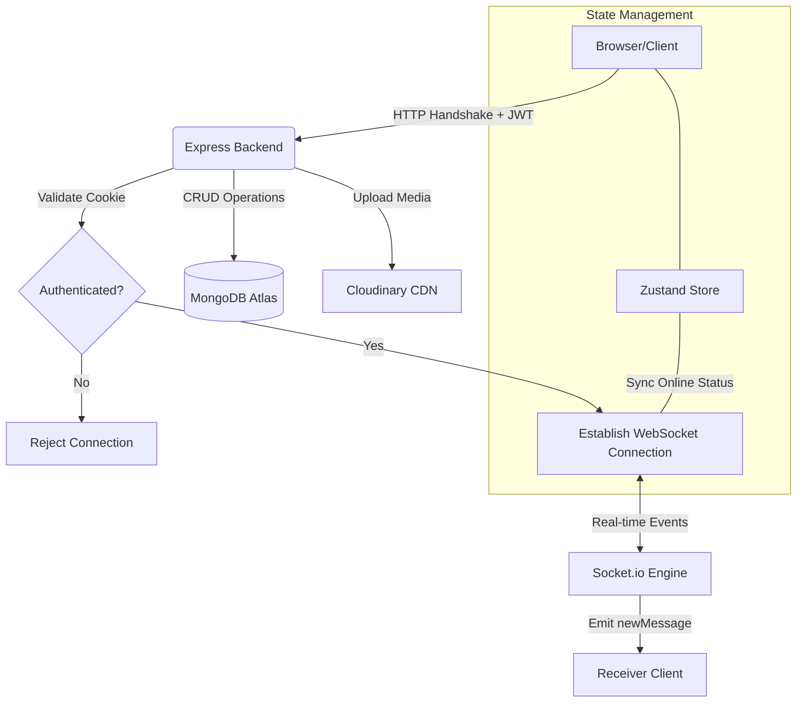

<h1 align="center">Chatny - Full-Stack Real-Time Messaging Architecture </h1>

**Chatny** is a high-performance, real-time messaging ecosystem built using the MERN stack. This project demonstrates advanced concepts in **Event-Driven Architecture**, secure **Session Management**, and scalable **Infrastructure Design**.

---

## System Architecture & Infrastructure

To understand how Chatny handles thousands of concurrent events, here is the high-level system flow:



1. The Real-Time Layer (WebSockets)

* **Engine**: Powered by Socket.io for low-latency, bi-directional communication.

* **Connection Logic**: We use a Singleton Pattern in the frontend store to ensure only one socket instance exists, preventing memory leaks and redundant handshakes.

* **Presence Tracking**: Online status is managed via an in-memory userSocketMap that syncs userIds with active socketIds.

---

## Technical Articles: Architectural Decisions

**Article 1: Secure WebSocket Handshaking**
Traditional WebSocket implementations often leave the connection open to unauthorized users.

* **Our Approach**: We implemented a Socket Middleware that intercepts the initial HTTP request. It parses the Cookie header and verifies the JWT before upgrading the connection to a WebSocket.

* **Outcome**: A secure, authenticated-only real-time tunnel.


**Article 2: Hybrid State Management (Zustand & Socket.io)**
One of the biggest challenges was keeping the UI in sync with server-side events.

* **The Solution**: By centralizing the Socket instance within the Zustand Auth Store, we allow components to subscribe to real-time events (like getOnlineUsers) as if they were local state variables.


**Article 3: Database Optimization for Messaging**
* **Schema Design**: We utilized Mongoose to create a relational-like structure in a NoSQL environment, using **ObjectIds** for efficient cross-referencing between Users and Messages.
* **Media Handling**: Instead of storing heavy binary data in MongoDB, we integrated **Cloudinary**. The database only stores the optimized URL strings, ensuring fast query responses even with high traffic.

* Highlights:

- Custom JWT Authentication (no 3rd-party auth)
- Real-time Messaging via Socket.io
- Online/Offline Presence Indicators
- Notification & Typing Sounds (with toggle)
- Welcome Emails on Signup (Resend)
- Image Uploads (Cloudinary)
- REST API with Node.js & Express
- MongoDB for Data Persistence
- API Rate-Limiting powered by Arcjet
- Beautiful UI with React, Tailwind CSS & DaisyUI
- Zustand for State Management
- Git & GitHub Workflow (branches, PRs, merges)  


---

## .env Setup

### Backend (`/backend`)

```bash
PORT=5000
MONGO_URI=your_mongo_uri_here

NODE_ENV=development

JWT_SECRET=your_jwt_secret

RESEND_API_KEY=your_resend_api_key
EMAIL_FROM=your_email_from_address
EMAIL_FROM_NAME=your_email_from_name

CLIENT_URL=http://localhost:5173

CLOUDINARY_CLOUD_NAME=your_cloudinary_cloud_name
CLOUDINARY_API_KEY=your_cloudinary_api_key
CLOUDINARY_API_SECRET=your_cloudinary_api_secret

ARCJET_KEY=your_arcjet_key
ARCJET_ENV=development
```

---

## Run the Backend

```bash
cd backend
npm install
npm run dev
```

## Run the Frontend

```bash
cd frontend
npm install
npm run dev
```
